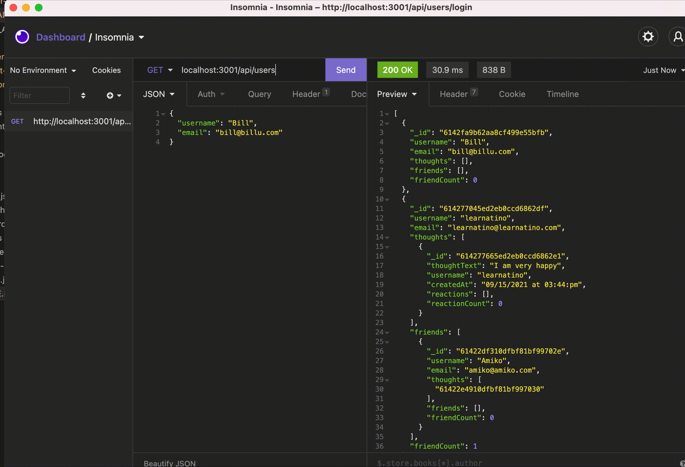

# my_media_app

## User Story
- As A social media startup, the user wants an API for their social network that uses a NoSQL database, so that their website can handle large amounts of unstructured data.

## About this Challenge

- Given a social network API
- When the user enter the command to invoke the application, then the server is started and the Mongoose models are synced to the MongoDB database.
- When the user open API GET routes in Insomnia Core for users and thoughts, then the data for each of these routes is displayed in a formatted JSON.
- When the user test API POST, PUT, and DELETE routes in Insomnia Core, then they are able to successfully create, update, and delete users and thoughts in my database.
- When the user test API POST and DELETE routes in Insomnia Core, then they are able to successfully create and delete reactions to thoughts and add and remove friends to a user’s friend list.

## Project Description

The following guidelines to set up your models and API routes:

### Models
#### User
* username
    * String
    * Unique
    * Required
    * Trimmed
* email
    * String
    * Required
    * Unique
    * Must match a valid email address (look into Mongoose's matching validation)

#### thoughts
    * Array of _id values referencing the Thought model
#### friends
    * Array of _id values referencing the User model (self-reference)
#### Schema Settings
    * Create a virtual called friendCount that retrieves the length of the user's friends array field on query.

#### Thought
* thoughtText
    * String
    * Required
    * Must be between 1 and 280 characters
* createdAt
    * Date
    * Set default value to the current timestamp
    * Use a getter method to format the timestamp on query
* username (The user that created this thought)
    * String
    * Required
* reactions (These are like replies)
    * Array of nested documents created with the reactionSchema
* Schema Settings
    * Create a virtual called reactionCount that retrieves the length of the thought's reactions array field on query.

#### Reaction (SCHEMA ONLY)
* reactionId
    * Use Mongoose's ObjectId data type
    * Default value is set to a new ObjectId
* reactionBody
    * String
    * Required
    * 280 character maximum
* username
    * String
    * Required
* createdAt
    * Date
    * Set default value to the current timestamp
    * Use a getter method to format the timestamp on query
* Schema Settings
    * This will not be a model, but rather will be used as the reaction field's subdocument schema in the Thought model.

#### API Routes
* /api/users
    * GET all users
    * GET a single user by its _id and populated thought and friend data
    * POST a new user:

*  Example data  

    { 
     "username": "lernantino", 
    "email": "lernantino@gmail.com" 
     } 

    * PUT to update a user by its _id
    * DELETE to remove user by its _id
    * BONUS: Remove a user's associated thoughts when deleted.

* /api/users/:userId/friends/:friendId 

    * POST to add a new friend to a user's friend list
    * DELETE to remove a friend from a user's friend list

* /api/thoughts
    * GET to get all thoughts
    * GET to get a single thought by its _id
    * POST to create a new thought (don't forget to push the created thought's _id to the associated user's thoughts array field)

* Example data 
{ 
  "thoughtText": "Here's a cool thought...", 
  "username": "lernantino", 
  "userId": "5edff358a0fcb779aa7b118b" 
} 

* PUT to update a thought by its _id
* DELETE to remove a thought by its _id

* /api/thoughts/:thoughtId/reactions
    * POST to create a reaction stored in a single thought's reactions array field
    * DELETE to pull and remove a reaction by the reaction's reactionId value

## Demo

### GET/api/users, GET/api/users/:id, GET/api/usthoughts, GET/api/thoughts/:id,

 
 
 

### POST/api/users, PUT/api/users/id, DELETE/api/id

 
 
 

### POST/api/users/userID/friends/friendID, DELETE/api/users/userID/friends/friendID

 
 
 

### POST/api/thoughts, PUT/api/thoughts/id, DELETE/api/id

 
 
 

### POST/api/thoughts/thoughtId/reactions/, DELETE/api/thoughts/thoughtId/reactions/ 

 
 
 

## GitHub Link
 
 https://github.com/sindhu-sp/blog

## Technologies Used:
- Mongoose
- Express
- Javascript

#### Sindhu Pillai